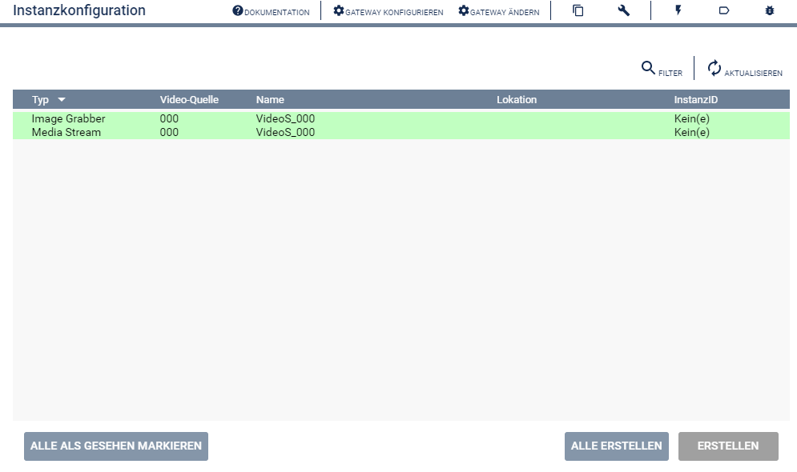
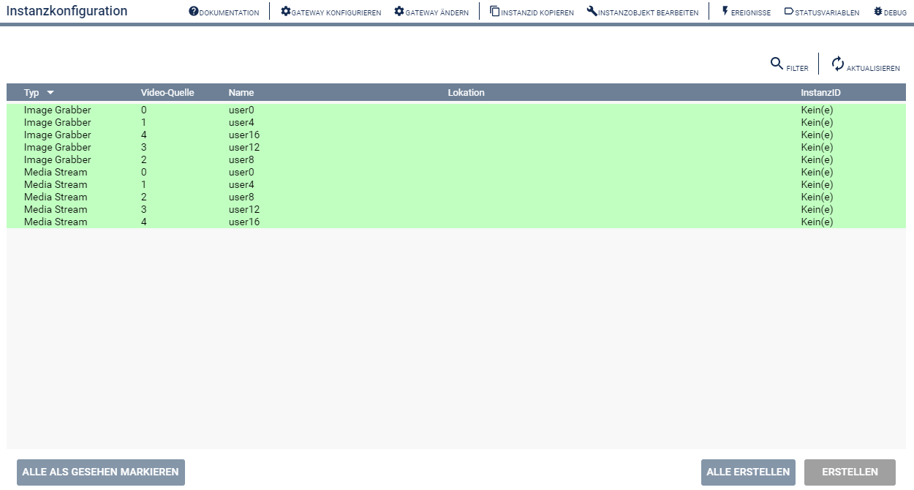

  

   
  

# ONVIF Configurator  <!-- omit in toc -->
Beschreibung des Moduls.

## Inhaltsverzeichnis <!-- omit in toc -->

- [1. Funktionsumfang](#1-funktionsumfang)
- [2. Vorraussetzungen](#2-vorraussetzungen)
- [3. Software-Installation](#3-software-installation)
- [4. Einrichten der Instanzen in IP-Symcon](#4-einrichten-der-instanzen-in-ip-symcon)
  - [Beispiel 1: Keine Digital IOs](#beispiel-1-keine-digital-ios)
  - [Beispiel 2: Mit Digital IOs](#beispiel-2-mit-digital-ios)
  - [Beispiel 3: Multikanal-Geräte](#beispiel-3-multikanal-geräte)
- [5. Statusvariablen](#5-statusvariablen)
- [6. WebFront](#6-webfront)
- [7. PHP-Funktionsreferenz](#7-php-funktionsreferenz)

## 1. Funktionsumfang

* Unterstützt beim Einrichten der verschiedenen Instanzen für ein ONVIF-Gerät.  

## 2. Vorraussetzungen

* IP-Symcon ab Version 5.5
* Kameras oder Video-Encoder mit ONVIF Profil S Unterstützung.  
* 
## 3. Software-Installation

* Über den Module Store das ['ONVIF'-Modul](../README.md) installieren.  

## 4. Einrichten der Instanzen in IP-Symcon

 Unter 'Instanz hinzufügen' ist das 'ONVIF Configurator'-Modul unter dem Hersteller 'ONVIF' aufgeführt.  
   
 Es wird empfohlen, die Instanzen über das [ONVIF Discovery'-Modul](../ONVIF%20Discovery/README.md) einzurichten.  

 Der Konfigurator ermöglicht es folgende Instanzen einfach zu erstellen und fertig zu konfigurieren:

- ONVIF Media Stream ([Dokumentation](../ONVIF%20Media%20Stream/README.md))
- ONVIF Image Grabber ([Dokumentation](../ONVIF%20Image%20Grabber/README.md))
- ONVIF Digital Input ([Dokumentation](../ONVIF%20Digital%20Input/README.md))
- ONVIF Digital Output ([Dokumentation](../ONVIF%20Digital%20Output/README.md))

Eventuell benötigte ONVIF Events Instanzen ([Dokumentation](../ONVIF%20Events/README.md)) sind manuell einzurichten.  

### Beispiel 1: Keine Digital IOs   
  
Hier wird als Beispiel ein Konfigurator eines Gerätes dargestellt, welche nur einen Videoeingang (Videosignal / Videoquelle) hat und über keine Digital I/O's verfügt.  

### Beispiel 2: Mit Digital IOs
  
Dieses Gerät hat ebenfalls nur einen Videoeingang (Videosignal / Videoquelle), verfügt aber über Digitale Ein- und Ausgänge.  

### Beispiel 3: Multikanal-Geräte

Dieses Gerät stellt 5 Videosignale (Videoquellen) bereit.  
In diesem Fall sind es 4 Videoeingänge und ein Quad-Bild aller 4 Videoeingänge.

## 5. Statusvariablen

Dieses Modul erzeugt keine Statusvariablen.  

## 6. WebFront

Dieses Modul ist nicht für die Darstellung im Webfront geeignet.  

## 7. PHP-Funktionsreferenz

Keine Funktionen verfügbar. 