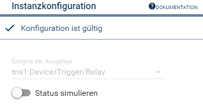
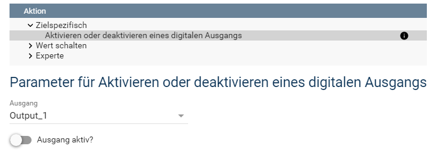

[](https://www.symcon.de/service/dokumentation/entwicklerbereich/sdk-tools/sdk-php/)
[](https://community.symcon.de/t/modul-onvif-profil-s-fuer-ip-kameras-und-encoder/52036)
[](https://www.symcon.de/service/dokumentation/installation/migrationen/v60-v61-q1-2022/)  
[](https://creativecommons.org/licenses/by-nc-sa/4.0/)
[](https://github.com/Nall-chan/ONVIF/actions)
[](https://github.com/Nall-chan/ONVIF/actions)  
[](#2-spenden)  

# ONVIF Digital Output  <!-- omit in toc -->
Bildet Digitale Ausgänge (Relays) in Symcon ab.  

## Inhaltsverzeichnis  <!-- omit in toc -->  

- [1. Funktionsumfang](#1-funktionsumfang)
- [2. Voraussetzungen](#2-voraussetzungen)
- [3. Software-Installation](#3-software-installation)
- [4. Einrichten der Instanzen in IP-Symcon](#4-einrichten-der-instanzen-in-ip-symcon)
- [5. Statusvariablen](#5-statusvariablen)
- [6. WebFront](#6-webfront)
- [7. PHP-Befehlsreferenz](#7-php-befehlsreferenz)
- [8. Aktionen](#8-aktionen)
- [9. Anhang](#9-anhang)
  - [1. Changelog](#1-changelog)
  - [2. Spenden](#2-spenden)
- [10. Lizenz](#10-lizenz)

## 1. Funktionsumfang

* Empfang von Statusmeldungen der Digitalen Ausgängen von ONVIF-Geräten.  
* Ansteuern der Digitalen Ausgänge über Symcon.  

## 2. Voraussetzungen

* IP-Symcon ab Version 7.0
* Kameras oder Video-Encoder mit ONVIF Profil S und/oder Profil T Unterstützung.
* Geräte müssen über mindestens einen Digitalen Ausgang (bzw. Relais) verfügen.  

## 3. Software-Installation

* Über den Module Store das  ['ONVIF'-Modul](../README.md) installieren.

## 4. Einrichten der Instanzen in IP-Symcon

 Unter 'Instanz hinzufügen' ist das 'ONVIF Digital Output'-Modul unter dem Hersteller 'ONVIF' aufgeführt.  
  

 Es wird empfohlen diese Instanz über die dazugehörige Instanz des [Configurator-Moduls](../ONVIF%20Configurator/README.md) von diesem Geräte anzulegen.  
 
__Konfigurationsseite__:

  

| Name          | Text                    | Beschreibung                                                                                                                                                                           |
| ------------- | ----------------------- | -------------------------------------------------------------------------------------------------------------------------------------------------------------------------------------- |
| EventTopic    | Ereignisse der Ausgänge | Auswahl des Ereignis-Pfad ab welchen Ereignisse empfangen und verarbeitet werden.                                                                                                      |
| EmulateStatus | Status simulieren       | Wenn aktiviert, wird die Statusvariable in Symcon auf den neuen Wert gesetzt, sobald ein Schaltbefehl erfolgreich übertragen wurde. Sonst wird nur über ankommende Ereignisse gesetzt. |

Der Ereignis-Pfad wird bei Digital-Outputs versucht automatisch zu erkennen, funktioniert dies nicht, ist das Eingabefeld aktiv und das Ereignis muss manuell ausgewählt werden.  

## 5. Statusvariablen

Die Statusvariablen werden automatisch angelegt und erhalten das `~Switch` Profil. Das Löschen einzelner Statusvariablen kann zu Fehlfunktionen führen.  

| Name                                                | Typ  | Beschreibung                                                               |
| --------------------------------------------------- | ---- | -------------------------------------------------------------------------- |
| je nach Name des Relay-Token aus dem Onvif-Ereignis | bool | Für jeden bekannten Output wird eine passende Variable in Symcon erstellt. |

## 6. WebFront

Die Statusvariablen haben eine hinterlegte Standardaktion und somit können die Ausgänge direkt aus dem WebFront bedient werden. 

Die direkte Darstellung der Statusvariablen ist möglich; es wird aber empfohlen mit Links zu arbeiten.  

## 7. PHP-Befehlsreferenz

```php
boolean ONVIF_SetRelayOutputState(integer $InstanzID, string $Ident, bool $Value);
```
De/Aktiviert den in `$Ident` übergeben Ausgang, je nach übergebenen Wert in `$Value`.  
Konnte der Befehl erfolgreich ausgeführt werden, wird `TRUE` zurückgegeben.  
Im Fehlerfall wird eine Warnung erzeugt und `FALSE` zurückgegeben.  

Beispiel:
`ONVIF_SetRelayOutputState(12345, '1', true);`  
Schalte Ausgang 1 an.

## 8. Aktionen

__Grundsätzlich können alle bedienbaren Statusvariablen als Ziel einer [`Aktion`](https://www.symcon.de/service/dokumentation/konzepte/automationen/ablaufplaene/aktionen/) mit 'Auf Wert schalten' angesteuert werden, so das hier keine speziellen Aktionen benutzt werden müssen.__

Dennoch gibt es eine Aktion für die 'ONVIF Digital Output' Instanz.  
Wenn so eine Instanz als Ziel einer Aktion ausgewählt wurde, steht folgende Aktion zur Verfügung:  
  
* Aktivieren oder deaktivieren eines digitalen Ausgang  

## 9. Anhang

### 1. Changelog

[Changelog der Library](../README.md#2-changelog)

### 2. Spenden

Die Library ist für die nicht kommerzielle Nutzung kostenlos, Schenkungen als Unterstützung für den Autor werden hier akzeptiert:  

  PayPal:  
<a href="https://www.paypal.com/donate?hosted_button_id=G2SLW2MEMQZH2" target="_blank"></a>  

  Wunschliste:  
<a href="https://www.amazon.de/hz/wishlist/ls/YU4AI9AQT9F?ref_=wl_share" target="_blank"></a>  

## 10. Lizenz

  IPS-Modul:  
  [CC BY-NC-SA 4.0](https://creativecommons.org/licenses/by-nc-sa/4.0/)  
