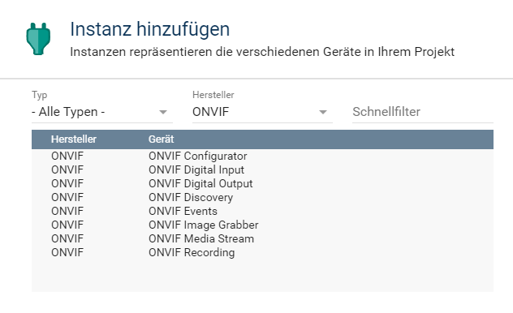
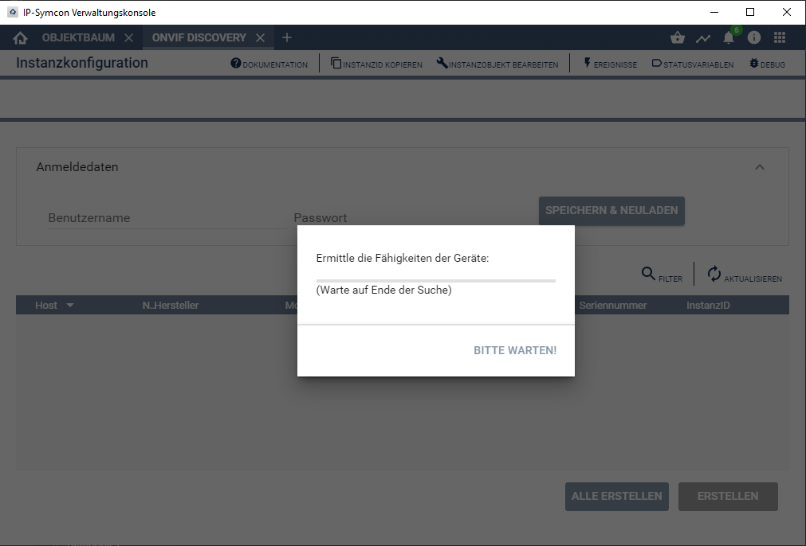

  

  
  

# ONVIF Discovery <!-- omit in toc -->
Erkennt ONVIF kompatible Geräte innerhalb des lokalen LAN.  

## Inhaltsverzeichnis <!-- omit in toc -->

- [1. Funktionsumfang](#1-funktionsumfang)
- [2. Voraussetzungen](#2-voraussetzungen)
- [3. Software-Installation](#3-software-installation)
- [4. Einrichten der Instanz in IP-Symcon](#4-einrichten-der-instanz-in-ip-symcon)
  - [Laden der Konfigurationsseite:](#laden-der-konfigurationsseite)
  - [Konfigurationsseite nach der Gerätesuche:](#konfigurationsseite-nach-der-gerätesuche)
  - [Anlegen von Geräten in Symcon:](#anlegen-von-geräten-in-symcon)
- [5. Statusvariablen](#5-statusvariablen)
- [6. WebFront](#6-webfront)
- [7. PHP-Funktionsreferenz](#7-php-funktionsreferenz)
- [8. Aktionen](#8-aktionen)
- [9. Anhang](#9-anhang)
  - [1. Changelog](#1-changelog)
  - [2. Spenden](#2-spenden)
- [10. Lizenz](#10-lizenz)

## 1. Funktionsumfang

  * Einfache Einrichtung von ONVIF-Konfiguratoren in Symcon.  
  * Erkennt ONVIF kompatible Geräte innerhalb des lokalen LAN.  

## 2. Voraussetzungen

* IP-Symcon ab Version 6.1  
* Kameras oder Video-Encoder mit ONVIF Profil S und/oder Profil T Unterstützung. 
* Geräte und Symcon müssen per Multicast kommunizieren können [(siehe 4.)](#laden-der-konfigurationsseite). 

## 3. Software-Installation

* Dieses Modul ist Bestandteil der [ONVIF-Library](../README.md#3-software-installation).    

## 4. Einrichten der Instanz in IP-Symcon

 Unter 'Instanz hinzufügen' ist das 'ONVIF Discovery'-Modul unter dem Hersteller 'ONVIF' aufgeführt.  
   
 Nach der Installation über den Store, wird eine Instanz von diesem Modul automatisch angelegt.  

 ### Laden der Konfigurationsseite:  

Beim öffnen der Instanz wird automatisch ein Suchlauf gestartet, sofern Symcon nicht unter Docker mit NAT betrieben wird:  
  

**Wird Symcon in einen Docker Container welcher per NAT angebunden ist betrieben, so wird eine Fehlermeldung ausgegeben. Diese Konstellation wird aufgrund der fehlenden Multicast Fähigkeiten von Docker nicht unterstützt.**  
**Werden die Geräte und Symcon über geroutete Netzwerke verbunden, so muss für das Discover die Multicast-Adresse `239.255.255.250` auf Port `3702` von Symcon zu den Geräten und UDP Port `3703` zu Symcon geroutet werden.**  

Bei gefundenen Geräten wird versucht die Fähigkeiten des jeweiligen Gerätes zu ermitteln.  
Dabei auftretende Fehler oder Probleme werden im Anschluss der Suche über ein Popup angezeigt.  
  

Die Fehlermeldungen enthalten weitere Hinweise, warum einige Geräte nicht in der anschließend angezeigten Liste zum erstellen auftauchen.  
So existieren Geräte welche zwingend eine Benutzeranmeldung voraussetzen(*). Oder, wenn Geräte auch eine verschlüsselte HTTPS-Verbindung unterstützen, mehrmals in der Fehlerliste auftauchen (Siehe rote Markierung im Bild).  

Der Dialog kann, bis zum ändern der Zugangsdaten, über den `Ignorieren` Button abgeschaltet werden.  

_(*) Siehe weiter unten._  

### Konfigurationsseite nach der Gerätesuche:  

| Name                                                                                                    | Text | Beschreibung |
| ------------------------------------------------------------------------------------------------------- | ---- | ------------ |
| __Die Discovery-Instanz hat keine Einstellungen, welche über IPS_SetProperty verändert werden können.__ |      |              |

  

Die Instanz listet alle im Netzwerk gefundenen Geräte auf und stellt sie, nach einem Abgleich der schon in Symcon eingerichteten [Configurator-Module](../ONVIF%20Configurator/README.md), tabellarisch in einer Liste dar.  

Sollten Zugangsdaten für die Geräte benötigt werden, was auf jeden Fall zu bevorzugen ist, dann werden Diese im Bereich `Anmeldedaten` als Benutzername und Passwort eingetragen.  
Über die `Speichern & Neuladen` Schaltfläche werden die Zugangsdaten übernommen, ein neuer Suchlauf gestartet und eine vorher ignorierte Fehlermeldung wieder aktiviert.  

### Anlegen von Geräten in Symcon:

Wird eine Zeile selektiert und die Schaltfläche `Erstellen` betätigt, so erzeugt Symcon automatisch mehrere Instanzen (*2).  
Es wird ein Instanz des [Configurator-Module](../ONVIF%20Configurator/README.md) erzeugt, welche automatisch den Namen vom Gerät erhält.  
Dazugehörig wird eine Instanz vom [IO-Module](../ONVIF%20IO/README.md) erzeugt, welche ebenfalls den Namen vom Gerät erhält.  
Die Namen der erzeugten Instanzen können selbstverständlich geändert werden, Sie dienen nur als Hilfsmittel um schnell eine Verbindung der Instanzen zueinander zu erkennen.  
In der erzeugten Instanz vom [IO-Module](../ONVIF%20IO/README.md) werden auch die Zugangsdaten mit übernommen. Dies erfolgt einmalig wenn so eine Kette von Instanzen über diese Discovery-Instanz erstellt wurde.  
__Nachträgliches ändern der Zugangsdaten muss direkt in den jeweiligen Instanzen vom [IO-Module](../ONVIF%20IO/README.md) erfolgen.__  

Wurden beide Instanzen erzeugt, ändert sich die Schaltfläche von `Erstellen` auf `Konfigurieren`.  
Hierüber wird dann direkt die Konfigurationsseite der zum Gerät gehörigen Instanz vom [Configurator-Module](../ONVIF%20Configurator/README.md) geöffnet.  
Das Anlegen der einzelnen Geräte-Instanzen erfolgt dort.  

_(*2) Eventuell erscheint eine Auswahlliste wo ausgewählt werden kann über welches Protokoll ( HTTP / HTTPS ) das Gerät in Symcon eingebunden werden soll._  

## 5. Statusvariablen

Dieses Modul erzeugt keine Statusvariablen.  

## 6. WebFront

Dieses Modul ist nicht für die Darstellung im Webfront geeignet.  

## 7. PHP-Funktionsreferenz

Keine Funktionen verfügbar.  

## 8. Aktionen

Keine Aktionen verfügbar.

## 9. Anhang

### 1. Changelog

[Changelog der Library](../README.md#2-changelog)

### 2. Spenden

Die Library ist für die nicht kommerzielle Nutzung kostenlos, Schenkungen als Unterstützung für den Autor werden hier akzeptiert:  

  PayPal:  
  

  Wunschliste:  
  

## 10. Lizenz

  IPS-Modul:  
  [CC BY-NC-SA 4.0](https://creativecommons.org/licenses/by-nc-sa/4.0/)  
