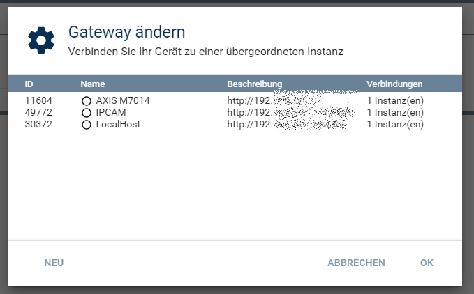
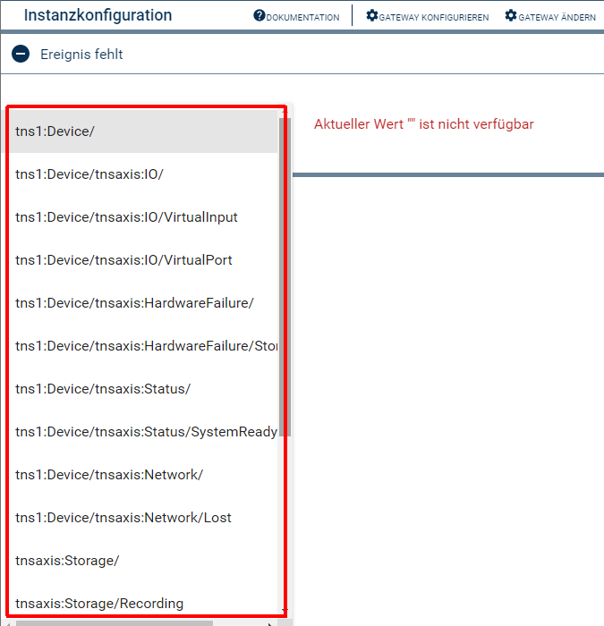

[](https://www.symcon.de/service/dokumentation/entwicklerbereich/sdk-tools/sdk-php/)
[]()
[](https://www.symcon.de/forum/threads/41251-IP-Symcon-5-5-%28Testing%29)  
[](https://creativecommons.org/licenses/by-nc-sa/4.0/)
[](https://github.com/Nall-chan/ONVIF/actions) [](https://github.com/Nall-chan/ONVIF/actions)  

# ONVIF Events
Bildet verschiedene Ereignisse (Events) als Statusvariablen in Symcon ab.

## Inhaltsverzeichnis <!-- omit in toc -->

- [ONVIF Events](#onvif-events)
  - [1. Funktionsumfang](#1-funktionsumfang)
  - [2. Vorraussetzungen](#2-vorraussetzungen)
  - [3. Software-Installation](#3-software-installation)
  - [4. Einrichten der Instanzen in IP-Symcon](#4-einrichten-der-instanzen-in-ip-symcon)
    - [Anlegen der Instanz:](#anlegen-der-instanz)
    - [Zuordnen zur IO-Instanz:](#zuordnen-zur-io-instanz)
    - [Auswahl des Ereignis-Pfad :](#auswahl-des-ereignis-pfad-)
  - [5. Statusvariablen](#5-statusvariablen)
    - [Beispiel 1: Ein einzelnes Ereignis](#beispiel-1-ein-einzelnes-ereignis)
    - [Beispiel 2: Ein einzelnes Ereignis, mehrere Quellen](#beispiel-2-ein-einzelnes-ereignis-mehrere-quellen)
    - [Beispiel 3: Ein Ordner](#beispiel-3-ein-ordner)
    - [Beispiel 4: Ein Teilbaum](#beispiel-4-ein-teilbaum)
  - [6. WebFront](#6-webfront)
  - [7. PHP-Funktionsreferenz](#7-php-funktionsreferenz)
  - [8. Tips & Tricks](#8-tips--tricks)

## 1. Funktionsumfang

* Empfang von Statusmeldungen von einem ONVIF-Gerät.  

## 2. Vorraussetzungen

* IP-Symcon ab Version 5.5  
* Kameras oder Video-Encoder mit ONVIF Profil S Unterstützung.
* Geräte müssen ONVIF-Events unterstützen.  

## 3. Software-Installation

* Über den Module Store das ['ONVIF'-Modul](../README.md) installieren.  

## 4. Einrichten der Instanzen in IP-Symcon

### Anlegen der Instanz:  

 Unter 'Instanz hinzufügen' ist das 'ONVIF Events'-Modul unter dem Hersteller 'ONVIF' aufgeführt.
  

Diese Instanzen können nicht über die dazugehörige Instanz des [Configurator-Moduls](../ONVIF%20Configurator/README.md) von diesem Geräte angelegt werden und müssen immer manuell erzeugt hinzugefügt werden.  

### Zuordnen zur IO-Instanz:    

  
Nach dem erzeugen der Instanz, muss zuerst über die Schaltfläche `Gateway ändern` die gewünschte IO-Instanz ausgewählt werden, von welcher Ereignisse empfangen werden sollen.  
  

### Auswahl des Ereignis-Pfad :  

Beispiel von Ereignissen:
  

| Name       | Text          | Beschreibung                                                                      |
| ---------- | ------------- | --------------------------------------------------------------------------------- |
| EventTopic | Ereignis-Pfad | Auswahl des Ereignis-Pfad ab welchen Ereignisse empfangen und verarbeitet werden. (*) |  

(*)  _Durch eine Änderung des Ereignis-Pfad werden die alten Statusvariablen hinfällig und müssen manuell gelöscht werden._  

Der Ereignis-Pfad kann ein einzelnen Ereignis oder mehrere Ereignisse abbilden.  
Der Pfad ist wie eine Baum/Ordner-Struktur zu verstehen und bildet alle Unterobjekte ab.  
Der initiale Name der erzeugten Statusvariablen integriert eventuelle Strukturen mit ab.  

## 5. Statusvariablen

Die Statusvariablen werden automatisch angelegt, sobald ein entsprechendes Ereignis empfangen wurde.  
Dies erfolgt immer, wenn sich die dazugehörige [IO-Instanz](../ONVIF%20IO/README.md) neu verbindet, sowie beim Systemstart von Symcon.  

### Beispiel 1: Ein einzelnes Ereignis

__Beispiel-Baum__  

```
tns1:Device
│    │──tnsaxis:IO
│    │   │──VirtualInput
│    │   └──VirtualPort
│    │──tnsaxis:HardwareFailure
│    │   └──StorageFailure
│    │──tnsaxis:Status
│    │   └──SystemReady
│    │──tnsaxis:Network
│    │   └──Lost
```

Als Ereignis-Pfad wurde nur `tns1:Device/tnsaxis:Status/SystemReady` ausgewählt.
Der Objektbaum enthält eine Statusvariable:  
  
Der Name entspricht der `Name der Daten`-Spalte aus der Tabelle der möglichen Ereignisse in der [IO-Instanz](../ONVIF%20IO/README.md) (Beispiel: `ready`).  

### Beispiel 2: Ein einzelnes Ereignis, mehrere Quellen

Als Ereignis-Pfad wurde der Ordner `tns1:Device/tnsaxis:HardwareFailure/StorageFailure` ausgewählt.
Der Objektbaum enthält, bei diesem Beispiel-Baum, zwei Statusvariablen:  
  
Der Name entspricht wieder der `Name der Daten`-Spalte aus der Tabelle der möglichen Ereignisse in der [IO-Instanz](../ONVIF%20IO/README.md) (Beispiel: `disruption`).  
Zusätzlich wird an dem Namen der Name der Quelle angehängt.  
In diesem Beispiel sind die Quellen die möglichen Typen von Speichermedien (Storage) `NetworkShare` und `SD_DISK`.  

### Beispiel 3: Ein Ordner

Als Ereignis-Pfad wurde der Ordner `tns1:Device/tnsaxis:HardwareFailure/` ausgewählt.
  
Der Objektbaum enthält, bei diesem Beispiel-Baum, wieder zwei Statusvariablen:  
Der Name der Statusvariable entspricht dem Beispiel 2, zusätzlich wird aber der jeweilige Name vom Ereignis (Beispiel: `StorageFailure`) vorangestellt.  

### Beispiel 4: Ein Teilbaum

Als Ereignis-Pfad wurde der Ordner `tns1:Device/` ausgewählt.
Der Objektbaum enthält, bei diesem Beispiel-Baum, vierzig Statusvariablen:  
  
Dem Namen der Statusvariablen wird, zusätzlich wie bei Beispiel 3, der jeweilige Name der Ebenen vorangestellt. 
Da einige Ereignisse mehrere Quellen haben, werden z.B. für `VirtualInput` alle 32 Quellen als Statusvariablen angelegt.   
In diesem Beispiel fehlt eine Statusvariable für ` Network - Lost`, da das Gerät keine Ereignisse für das Event `tns1:Device/tnsaxis:Network/Lost` sendet.  
Das ist nicht verwunderlich, da ohne Netzwerkverbindung kein Ereignis mehr versendet werden kann und somit das Gerät dieses Event nie mit einen `false` senden könnte.  

## 6. WebFront

Die direkte Darstellung der Statusvariablen von Ereignissen ist möglich; es wird aber empfohlen mit Links zu arbeiten.  

## 7. PHP-Funktionsreferenz

Keine Funktionen verfügbar.  

## 8. Tips & Tricks

Events für Videoquellen können direkt in der [Stream-Instanz](../ONVIF%20Media%20Stream/README.md)  oder der [Image Grabber-Instanz](../ONVIF%20Image%20Grabber/README.md) verarbeitet werden.  
Hier wird automatisch auf die korrekte `VideoSource` gefiltert, welche in diesen Instanzen konfiguriert wurde.  
