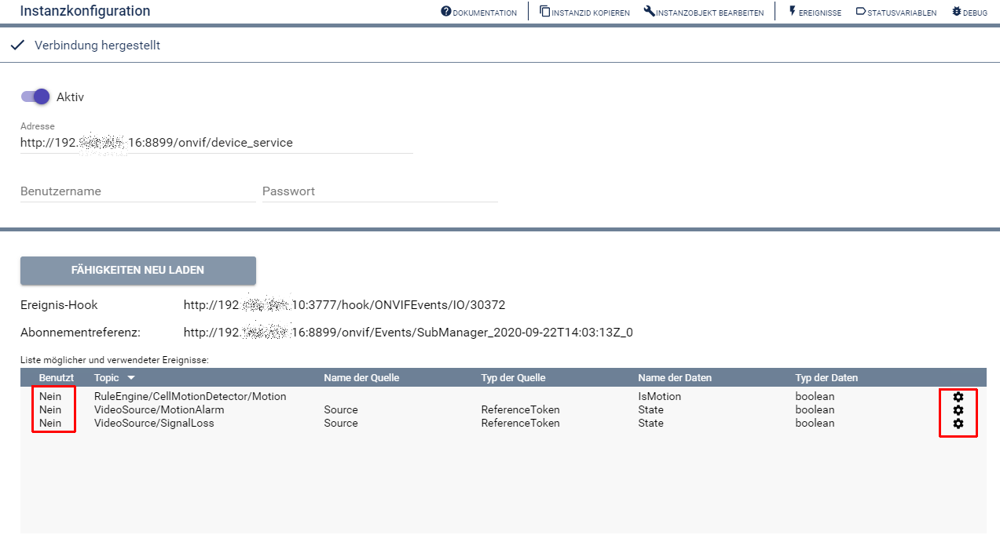

  

  
  

# ONVIF IO  <!-- omit in toc -->
Stellt die Verbindung zu einem ONVIF-Gerät her.  

## Inhaltsverzeichnis <!-- omit in toc -->

- [1. Funktionsumfang](#1-funktionsumfang)
- [2. Voraussetzungen](#2-voraussetzungen)
- [3. Software-Installation](#3-software-installation)
- [4. Einrichten der Instanzen in IP-Symcon](#4-einrichten-der-instanzen-in-ip-symcon)
  - [Konfigurationsseite: Übersicht](#konfigurationsseite-übersicht)
  - [Konfigurationsseite: Ereignisse möglich](#konfigurationsseite-ereignisse-möglich)
  - [Konfigurationsseite: Ereignisse nicht möglich](#konfigurationsseite-ereignisse-nicht-möglich)
- [5. Statusvariablen](#5-statusvariablen)
- [6. WebFront](#6-webfront)
- [7. PHP-Funktionsreferenz](#7-php-funktionsreferenz)
- [8. Aktionen](#8-aktionen)
- [9. Anhang](#9-anhang)
  - [1. Changelog](#1-changelog)
  - [2. Spenden](#2-spenden)
- [10. Lizenz](#10-lizenz)

## 1. Funktionsumfang

* Interface für die Kommunikation mit einem ONVIF Profil S kompatiblen Gerät.  
* Ereignisverwaltung für Geräte welche Events unterstützen.  

## 2. Voraussetzungen

* IP-Symcon ab Version 6.1
* Kameras oder Video-Encoder mit ONVIF Profil S Unterstützung.  

## 3. Software-Installation

* Dieses Modul ist Bestandteil der [ONVIF-Library](../README.md#3-software-installation).  

## 4. Einrichten der Instanzen in IP-Symcon

 Unter 'Instanz hinzufügen' ist das 'ONVIF IO'-Modul unter dem Hersteller 'ONVIF' aufgeführt.  
  

 Diese Instanz wird automatisch angelegt, wenn im ['Discovery-Modul'](../ONVIF%20Discovery/README.md) ein Gerät in Symcon angelegt wird.  
 
 ### Konfigurationsseite: Übersicht

  

| Name         | Text                | Beschreibung                                                                  |
| ------------ | ------------------- | ----------------------------------------------------------------------------- |
| Open         | Aktiv               | Öffnet/Aktiviert die Verbindung zum Gerät.                                    |
| Address      | Adresse             | URL zum ONVIF Device-Service (z.B. http://192.168.1.111/onvif/device_service) |
| Username     | Benutzername        | Benutzername für die Anmeldung                                                |
| Password     | Passwort            | Passwort zum Benutzernamen                                                    |
| WebHookIP    | Experteneinstellung | IP Adresse unter welcher IPS von dem Gerät aus erreichbar ist.                |
| WebHookPort  | Experteneinstellung | Port unter welchem IPS von dem Gerät aus erreichbar ist (3777)                |
| WebHookHTTPS | Experteneinstellung | true wenn https benutzt werden soll                                           |

### Konfigurationsseite: Ereignisse möglich  

  

Der Aktions-Bereich zeigt aktuelle Informationen zur Verbindung an, sofern das Gerät ONVIF-Ereignisse unterstützt.  
Es wird der `Ereignis-Hook`, auf welchen Symcon die Nachrichten des Endgerätes empfängt angezeigt. Ebenso wie auch die `Abonnementreferenz`, welche Symcon vom Gerät erhalten hat.  
Die IP-Adresse des `Ereignis-Hook` wird automatisch ermittelt, je nachdem über welchen Adresse das Gerät erreichbar ist.  
**Diese Erkennung funktioniert nicht bei NAT, da hier die externe Adresse Symcon nicht automatisch ermitteln kann.  
Es müssen die [Spezialschalter](https://www.symcon.de/service/dokumentation/entwicklerbereich/spezialschalter/) `NATSupport` und `NATPublicIP` benutzt werden**  

**Wird der übliche Port (3777) von Symcon nicht benutzt (z.B. forwarding NAT) so kann hier der Port, unter welchen Symcon erreichbar ist, angepasst werden.** 

In der Tabelle wird eine Liste aller vom Gerät gemeldeten Ereignissen angezeigt, welche sich in Symcon nutzen lassen. Über das Feld `Benutzt` wird angezeigt ob das Ereignis in einer Instanz konfiguriert wurde. Und über das Zahnrad einer Zeile werden diese Instanzen tabellarisch angezeigt.  

Die Fähigkeiten der Geräte werden beim Systemstart und anlegen von Instanzen ermittelt und innerhalb Symcon zwischengespeichert; da dieser Vorgang einige Zeit dauern kann.  
Wird das Gerät selber umkonfiguriert, z.B. Änderung der Stream/ONVIF-Profile, oder erhält z.B. ein Firmware-Update, so kann über den Button `Fähigkeiten neu laden` die Instanz veranlasst werden die Fähigkeiten neu zu laden.  

### Konfigurationsseite: Ereignisse nicht möglich  

  

Geräte welche beim ermitteln der Fähigkeiten von Ereignissen eine Fehlermeldung an Symcon melden, werden mit einem entsprechenden Hinweis dargestellt.  

## 5. Statusvariablen

Dieses Modul erzeugt keine Statusvariablen.  

## 6. WebFront

Dieses Modul ist nicht für die Darstellung im Webfront geeignet.  

## 7. PHP-Funktionsreferenz

Keine Funktionen verfügbar. 

## 8. Aktionen

Keine Aktionen verfügbar.

## 9. Anhang

### 1. Changelog

[Changelog der Library](../README.md#2-changelog)

### 2. Spenden

Die Library ist für die nicht kommerzielle Nutzung kostenlos, Schenkungen als Unterstützung für den Autor werden hier akzeptiert:  

  PayPal:  
  

  Wunschliste:  
  

## 10. Lizenz

  IPS-Modul:  
  [CC BY-NC-SA 4.0](https://creativecommons.org/licenses/by-nc-sa/4.0/)  
